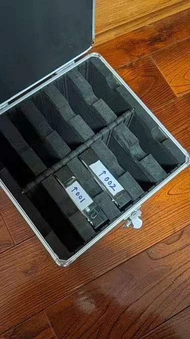
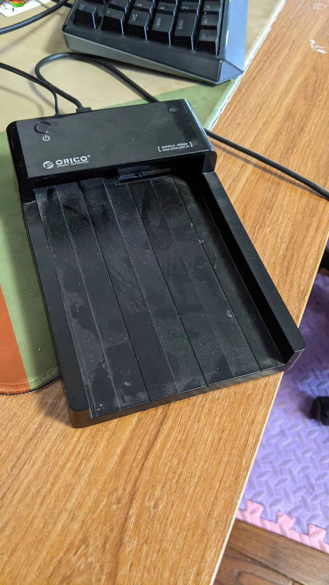
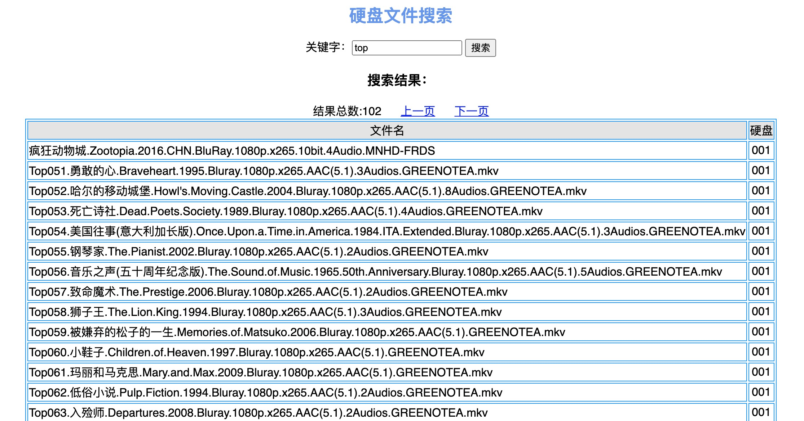

# 硬盘文件管理服务端

## 背景
本人喜欢下载电影，然后在5.1声道的家庭影院里观赏。

但是平时看电影的时间不多，要加班、带娃，偶尔欣赏一部大片。

也想过买个一个8盘位的nas，来下载、保存电影，但是考虑到nas的成本、电费等原因，有点浪费。

我希望的一个方式是，下载好电影后，保存到一块离线硬盘上，并给这个硬盘编好码，把然后把硬盘里的文件名录入到一个系统里。

需要看一部电影的时候，通过这个系统搜索一下，就可以知道电影放在哪块硬盘里。

于是就有这个这个系统。




## 介绍
这个是服务端。客户端在这里[hd-manager-gui](https://github.com/worldmaomao/hd-manager-gui)

很简单的程序，用于管理离线硬盘及其文件，方便查询。

## 配置文件 configuration.toml
```configuration.toml
[Service]
Host = "0.0.0.0"
Port = 48077
JwtKey = "00f5cd91-d372-46eb-b9cc-21b33f6cd976"

[Database]
Host = "192.168.10.201"
Port = 27017
DatabaseName = "disk-mgr"
Username = ""
Password = ""
```

+ 数据库使用mongodb
+ 建议修改JwtKey，这个和认证有关


## 在线查询文件的url

在线查询：http://ip:48077/index.html

截图：


## docker

[https://hub.docker.com/repository/docker/worldmaomao/hd-manager](https://hub.docker.com/repository/docker/worldmaomao/hd-manager)


